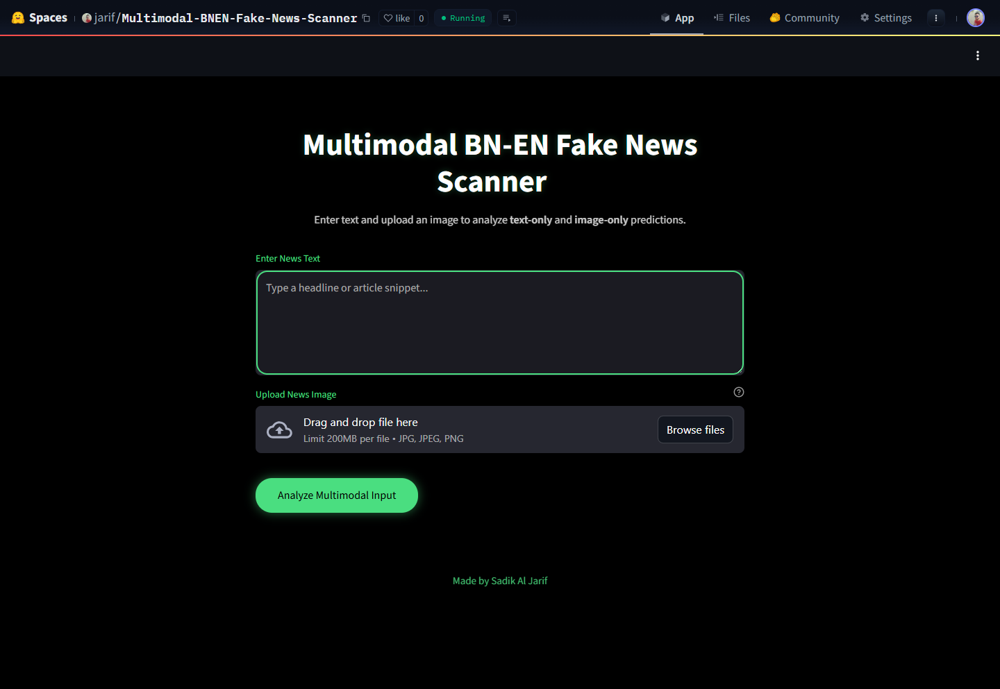

# 🛡️ Multimodal BN-EN Fake News Scanner

A **multimodal fake news detection system** for **Bangla-English (BN-EN)** content using **CLIP + ONNX**, capable of analyzing **text-only** and **image-only** signals to detect misinformation.

Built with:
- 🔹 `openai/clip-vit-base-patch32`
- 🔹 Fine-tuned on BN-EN fake/real news pairs
- 🔹 Quantized to ONNX for fast, lightweight inference
- 🔹 Streamlit UI for easy interaction

🎯 **Use Case**: Detect misleading social media posts, fake headlines and manipulated media in South Asian context.

[](https://huggingface.co/spaces/jarif/Multimodal-BNEN-Fake-News-Scanner) 
---

## 📸 Demo

 

> The app analyzes:
> - 📄 **Text Analysis** (with image zeroed)
> - 🖼️ **Image Analysis** (with text zeroed)
> - ✅ Confidence scores for both modalities

---

## 🚀 Features

- ✅ **Multimodal Input**: Text + Image
- 🔍 **Text-Only & Image-Only Mode**: Isolate modality bias
- 📉 **Quantized ONNX Model**: ~50% smaller, faster CPU inference
- 🌍 **Bangla + English Support**
- 💾 **No Heavy Dependencies**: ONNX runtime is lightweight
- 🧩 **Modality Fusion**: Combined image-text embeddings via CLIP

---

## 📦 Installation

```
git clone https://github.com/jarif87/multimodal-bn-en-fake-news-scanner.git
```
## Create Virtual Environment (Recommended)
```
python -m venv venv
source venv/bin/activate  # On Windows: venv\Scripts\activate
```

## Install Dependencies
```
pip install -r requirements.txt
```
## 🧪 Run Locally
```
streamlit run streamlit_app.py
```

 

## 📦 Model Details
- Base Model: openai/clip-vit-base-patch32
- Task: Binary Classification (Real vs Fake)
- Fine-Tuned On: Custom BN-EN multimodal dataset
- Classifier Head: Linear layer on combined CLIP embeddings
- Inference Format: ONNX (quantized, INT8)
- Model Size: ~180MB (quantized) vs ~350MB (original)

## 📥 Requirements
```
streamlit==1.48.0
transformers==4.52.4
torch==2.6.0
onnx==1.18.0
onnxruntime==1.22.1
```
## 🙌 Acknowledgements
- OpenAI CLIP
- Hugging Face Transformers
- ONNX Runtime
- Bangla NLP Community